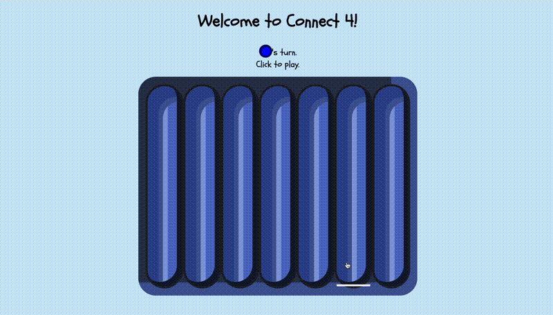

# Connect-4

> This is a browser based Connect-4 game featuring a computer opponent using the minimax algorithm. It was built from mid November into late December. Originally, a C++ version without a "bot" opponent was created. This iteration focuses on introducing a bot opponent while maintaining object oriented programming throughout.
## View on deployed site
- https://t-a-s-h.github.io/connect-4_ts/
## Installation instructions (to run locally)
- Download **this** repository.
	- [Download ZIP](https://github.com/t-a-s-h/connect-4_ts/archive/refs/heads/main.zip)
- Unzip the file.
- Use **Terminal** to navigate to the newly created directory.
	- Tip: type `cd ` then drag the newly created folder into **Terminal** and press **Enter**.
- Install npm packages
	```bash
	npm i
	```
- Compile Typescript
	```bash
	tsc
	```
- Start the local server
	```bash
	npx live-server 
	```
- Open the provided URL (usually http://localhost:8080).
## Demo


## Core features
- Use of Object Oriented programming (OOP) throughout most of the codebase.
	- Including the [Observer design pattern](https://en.wikipedia.org/wiki/Observer_pattern) for UI updates.
- Decision-making strategy for Computer Opponent powered by [Minimax](https://en.wikipedia.org/wiki/Minimax) .
- Uses functional undo for tentative moves.
- Emphasis on readability and maintainability.
## Technical decisions
- **OOP-first approach**

	Object-Oriented Programming is used as much as possible. This makes the logic easier to extend to other grid based games in the future.
- **Segment based win tracking**

	`Segment` objects  are used to track the length of each contiguous segment of the same player. This avoids having to run a function every play to determine if a player has won.
- **Minimax for Decision making**

	Minimax was chosen as an appropriate option for Connect-4.
- **Functional undo over other options**

	After experimentation and thought, functional undo was chosen (instead of cloning or a snapshot approach). This proved to be the fastest running (and simplest) way.
## What I learned
- Strictly adhering to one programming paradigm (such as OOP) is often not ideal in practice — hybrid approaches can lead to better, clearer solutions with easier maintenance.
- Perfection often comes second to getting something to work for its intended purpose. This game is playable (and potentially winnable for most players) — even if the heuristic produces a minimax implementation that is not *technically perfect*.
## Known limitations
- Uses a heuristic in minimax calculations. The heuristic I came up with works in many situations but fails in some. For instance, it has a tendency to build up columns that cannot produce a win.
- This implementation of Minimax using my heuristic, is not strictly non-decreasing when playing against itself (for number of wins vs. depth).
## Next steps
- Add guards to detect if a segment can produce a win.
	- Use this to avoid having the bot play "dead-end" moves.
- If the heuristic improves sufficiently, have difficulty increase as the player wins and passes on to each level.
## Tests
- Included unit tests intentionally focus on game logic rather than UI.